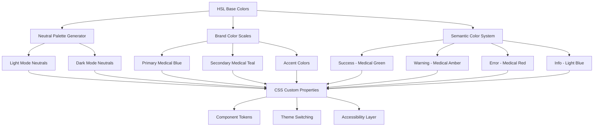
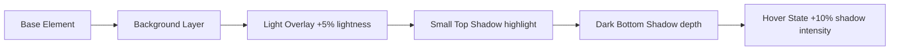

# Comprehensive Design System - Design Document

## Overview

This design document outlines a comprehensive color and visual design system for the medicine delivery platform. The system is built on scientific color theory principles, emphasizing HSL color format for intuitive palette creation, depth through strategic shadow implementation, and semantic color usage optimized for medical applications.

The design leverages the existing color foundation while enhancing it with systematic depth creation, improved accessibility, and advanced color format support to create a cohesive, professional, and trustworthy user interface.

## Architecture

### Color System Architecture



### Depth and Shadow System



## Components and Interfaces

### 1. Color Foundation System

#### HSL Color Generator

```typescript
interface HSLColor {
  hue: number; // 0-360
  saturation: number; // 0-100
  lightness: number; // 0-100
}

interface ColorScale {
  50: string; // Lightest
  100: string;
  200: string;
  300: string;
  400: string;
  500: string; // Base color
  600: string;
  700: string;
  800: string;
  900: string; // Darkest
}
```

#### Neutral Color System

- **Base Configuration**: Saturation set to 0% for true neutrals
- **Light Mode Scale**: Lightness values from 98% (background) to 8% (high contrast text)
- **Dark Mode Scale**: Inverted lightness values (100 - light mode value) with manual adjustments
- **Semantic Naming**: Background, surface, text tokens that work across themes

#### Brand Color Implementation

- **Primary Medical Blue**: Hue 210°, Saturation 75%, Lightness variations
- **Secondary Medical Teal**: Hue 160°, Saturation 60%, Lightness variations
- **Accent Purple**: Hue 280°, Saturation 70%, for special highlights

### 2. Depth Creation System

#### Shadow Implementation Strategy

```css
/* Small natural shadow */
.depth-1 {
  box-shadow: 0 1px 0 0 hsl(var(--color-light-overlay)), /* Top highlight */ 0
      1px 3px 0 hsl(var(--color-shadow-light)); /* Bottom shadow */
}

/* Medium depth for cards */
.depth-2 {
  box-shadow: inset 0 1px 0 0 hsl(var(--color-light-overlay)), 0 2px 8px 0 hsl(var(--color-shadow-medium));
}

/* High depth for modals/overlays */
.depth-3 {
  box-shadow: inset 0 1px 0 0 hsl(var(--color-light-overlay)), 0 8px 24px 0 hsl(var(--color-shadow-heavy));
}
```

#### Color Layering Technique

1. **Base Layer**: Primary background color
2. **Overlay Layer**: +5% lightness for subtle elevation
3. **Highlight Layer**: +10% lightness for selected/active states
4. **Shadow Layer**: Darker variants for depth perception

### 3. Semantic Color System

#### Medical Context Colors

```typescript
interface MedicalColors {
  emergency: {
    primary: 'hsl(0, 85%, 50%)'; // High-visibility red
    background: 'hsl(0, 90%, 95%)'; // Light red background
    border: 'hsl(0, 75%, 70%)'; // Medium red border
  };

  safe: {
    primary: 'hsl(145, 70%, 45%)'; // Medical green
    background: 'hsl(145, 85%, 95%)'; // Light green background
    border: 'hsl(145, 75%, 70%)'; // Medium green border
  };

  prescription: {
    primary: 'hsl(210, 75%, 55%)'; // Medical blue
    background: 'hsl(210, 90%, 95%)'; // Light blue background
    border: 'hsl(210, 80%, 70%)'; // Medium blue border
  };
}
```

### 4. Advanced Color Format Support

#### OKLCH Integration

```typescript
interface OKLCHColor {
  lightness: number; // 0-1
  chroma: number; // 0-0.4 typically
  hue: number; // 0-360
}

// Conversion utilities
function hslToOKLCH(hsl: HSLColor): OKLCHColor;
function oklchToHSL(oklch: OKLCHColor): HSLColor;
```

## Data Models

### Color Token Structure

```typescript
interface ColorTokens {
  // Base color definitions
  colors: {
    neutral: ColorScale;
    primary: ColorScale;
    secondary: ColorScale;
    success: ColorScale;
    warning: ColorScale;
    error: ColorScale;
    info: ColorScale;
  };

  // Semantic tokens
  semantic: {
    background: {
      primary: string;
      secondary: string;
      tertiary: string;
      elevated: string;
    };
    text: {
      primary: string;
      secondary: string;
      muted: string;
      contrast: string;
      disabled: string;
    };
    border: {
      primary: string;
      secondary: string;
      focus: string;
    };
    interactive: {
      primary: string;
      primaryHover: string;
      primaryActive: string;
      secondary: string;
      secondaryHover: string;
    };
  };

  // Shadow definitions
  shadows: {
    small: string;
    medium: string;
    large: string;
    overlay: string;
  };
}
```

### Theme Configuration

```typescript
interface ThemeConfig {
  name: string;
  colors: ColorTokens;
  shadows: ShadowTokens;
  spacing: SpacingTokens;
  typography: TypographyTokens;
}

interface DesignSystem {
  themes: {
    light: ThemeConfig;
    dark: ThemeConfig;
  };
  components: ComponentTokens;
  utilities: UtilityClasses;
}
```

## Error Handling

### Color Accessibility Validation

```typescript
interface AccessibilityChecker {
  validateContrast(
    foreground: string,
    background: string,
  ): {
    ratio: number;
    wcagAA: boolean;
    wcagAAA: boolean;
  };

  validateColorBlindness(colors: string[]): {
    protanopia: boolean;
    deuteranopia: boolean;
    tritanopia: boolean;
  };

  suggestAlternatives(failedColor: string, background: string): string[];
}
```

### Fallback Strategies

1. **Color Format Fallbacks**: HSL → RGB → Hex for browser compatibility
2. **Theme Fallbacks**: System preference detection with manual override
3. **Contrast Fallbacks**: Automatic contrast adjustment for accessibility compliance
4. **Shadow Fallbacks**: Graceful degradation for older browsers

## Testing Strategy

### Visual Regression Testing

```typescript
interface VisualTests {
  // Component color consistency
  testComponentColors(): Promise<TestResult>;

  // Theme switching functionality
  testThemeTransitions(): Promise<TestResult>;

  // Accessibility compliance
  testContrastRatios(): Promise<TestResult>;

  // Cross-browser color rendering
  testColorAccuracy(): Promise<TestResult>;
}
```

### Accessibility Testing

1. **Automated Contrast Checking**: WCAG AA/AAA compliance validation
2. **Color Blindness Simulation**: Testing with different vision types
3. **Screen Reader Compatibility**: Ensuring color information has alternatives
4. **Keyboard Navigation**: Focus states with sufficient contrast

### Performance Testing

1. **CSS Custom Property Performance**: Measuring theme switching speed
2. **Shadow Rendering Performance**: Testing complex shadow combinations
3. **Color Calculation Performance**: HSL/OKLCH conversion benchmarks

## Implementation Guidelines

### CSS Architecture

```css
:root {
  /* Base HSL values for easy manipulation */
  --hue-primary: 210;
  --saturation-primary: 75%;
  --lightness-primary: 55%;

  /* Computed color values */
  --color-primary: hsl(
    var(--hue-primary),
    var(--saturation-primary),
    var(--lightness-primary)
  );
  --color-primary-hover: hsl(
    var(--hue-primary),
    var(--saturation-primary),
    calc(var(--lightness-primary) - 8%)
  );

  /* Shadow system */
  --shadow-color: hsl(var(--hue-primary), 20%, 20%);
  --shadow-small: 0 1px 3px 0 hsl(var(--shadow-color) / 0.1);
  --shadow-medium: 0 4px 12px 0 hsl(var(--shadow-color) / 0.15);
}

[data-theme='dark'] {
  --lightness-primary: 65%; /* Adjusted for dark mode */
  --shadow-color: hsl(0, 0%, 0%);
}
```

### Component Integration

```typescript
// React Native StyleSheet integration
const createThemedStyles = (theme: ThemeConfig) =>
  StyleSheet.create({
    card: {
      backgroundColor: theme.colors.semantic.background.secondary,
      shadowColor: theme.shadows.medium.color,
      shadowOffset: theme.shadows.medium.offset,
      shadowOpacity: theme.shadows.medium.opacity,
      shadowRadius: theme.shadows.medium.radius,
      elevation: theme.shadows.medium.elevation, // Android
    },

    primaryButton: {
      backgroundColor: theme.colors.semantic.interactive.primary,
      shadowColor: theme.colors.primary[700],
      // Hover state for web
      ':hover': {
        backgroundColor: theme.colors.semantic.interactive.primaryHover,
        shadowOpacity: theme.shadows.medium.opacity * 1.5,
      },
    },
  });
```

### Real-time Color Manipulation

```typescript
interface ColorManipulator {
  adjustHue(color: string, degrees: number): string;
  adjustSaturation(color: string, percentage: number): string;
  adjustLightness(color: string, percentage: number): string;

  generateScale(baseColor: HSLColor, steps: number): ColorScale;
  createComplementary(baseColor: HSLColor): HSLColor;
  createAnalogous(baseColor: HSLColor): HSLColor[];
}
```

This design provides a comprehensive foundation for implementing a sophisticated color system that addresses all the requirements while maintaining flexibility for future enhancements and ensuring excellent user experience across all use cases.
