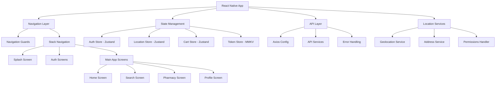

# Design Document

## Overview

This design document outlines the architecture and implementation approach for transforming the MedCo React Native application into a comprehensive medicine delivery platform. The design leverages the existing robust architecture including Zustand state management, MMKV storage, Axios utilities, navigation guards, and the established design system to create a Swiggy/Zomato-like experience for medicine delivery.

## Architecture

### High-Level Architecture



### Core Services Integration

The design builds upon the existing service architecture:

1. **Authentication Flow**: Utilizes existing AuthStore and AuthService with enhanced location-aware navigation
2. **API Communication**: Leverages established AxiosUtil and API response patterns
3. **Navigation**: Extends NavigationUtils with location-based routing
4. **State Management**: Adds new Zustand stores for location, pharmacy, and cart management
5. **Design System**: Utilizes existing component library with new location and pharmacy-specific components

## Components and Interfaces

### New Core Components

#### 1. Location Components

**LocationPicker Component**

```typescript
interface LocationPickerProps {
  onLocationSelect: (location: LocationData) => void;
  currentLocation?: LocationData;
  showCurrentLocation?: boolean;
  placeholder?: string;
}

interface LocationData {
  latitude: number;
  longitude: number;
  address: string;
  area: string;
  city: string;
  pincode: string;
}
```

**LocationDisplay Component**

```typescript
interface LocationDisplayProps {
  location: LocationData;
  onChangeLocation: () => void;
  compact?: boolean;
  showChangeButton?: boolean;
}
```

#### 2. Pharmacy Components

**PharmacyCard Component**

```typescript
interface PharmacyCardProps {
  pharmacy: PharmacyData;
  onPress: () => void;
  showDistance?: boolean;
  showDeliveryInfo?: boolean;
}

interface PharmacyData {
  id: string;
  name: string;
  rating: number;
  distance: number;
  deliveryTime: number;
  deliveryFee: number;
  minimumOrder: number;
  isOpen: boolean;
  address: string;
  imageUrl?: string;
}
```

**PharmacyList Component**

```typescript
interface PharmacyListProps {
  pharmacies: PharmacyData[];
  onPharmacySelect: (pharmacy: PharmacyData) => void;
  loading?: boolean;
  refreshing?: boolean;
  onRefresh?: () => void;
}
```

#### 3. Search Components

**SearchBar Component**

```typescript
interface SearchBarProps {
  onSearch: (query: string) => void;
  onFocus?: () => void;
  placeholder?: string;
  showFilter?: boolean;
  onFilterPress?: () => void;
}
```

**SearchSuggestions Component**

```typescript
interface SearchSuggestionsProps {
  suggestions: string[];
  onSuggestionPress: (suggestion: string) => void;
  visible: boolean;
}
```

#### 4. Banner Components

**BannerCarousel Component**

```typescript
interface BannerCarouselProps {
  banners: BannerData[];
  onBannerPress: (banner: BannerData) => void;
  autoScroll?: boolean;
  autoScrollInterval?: number;
}

interface BannerData {
  id: string;
  imageUrl: string;
  title: string;
  description?: string;
  actionUrl?: string;
  actionType: 'pharmacy' | 'category' | 'offer' | 'external';
}
```

### Enhanced Existing Components

#### StatusBar Component

```typescript
interface StatusBarProps {
  backgroundColor?: string;
  barStyle?: 'light-content' | 'dark-content';
  translucent?: boolean;
  hidden?: boolean;
}
```

#### Screen Component Enhancement

```typescript
interface ScreenProps {
  children: React.ReactNode;
  scrollable?: boolean;
  padded?: boolean;
  centered?: boolean;
  statusBarStyle?: 'light' | 'dark' | 'auto';
  backgroundColor?: string;
  safeArea?: boolean;
}
```

## Data Models

### Location Models

```typescript
interface UserLocation {
  latitude: number;
  longitude: number;
  address: string;
  area: string;
  city: string;
  state: string;
  pincode: string;
  accuracy?: number;
  timestamp: number;
}

interface SavedAddress {
  id: string;
  label: string;
  location: UserLocation;
  isDefault: boolean;
  type: 'home' | 'work' | 'other';
  deliveryInstructions?: string;
}
```

### Pharmacy Models

```typescript
interface Pharmacy {
  id: string;
  name: string;
  description?: string;
  licenseNumber: string;
  email: string;
  phone: string;
  address: UserLocation;
  rating: number;
  totalRatings: number;
  isOpen: boolean;
  isActive: boolean;
  status: 'approved' | 'pending' | 'rejected';
  distance?: number;
  deliveryRadius: number;
  minimumOrderAmount: number;
  deliveryFee: number;
  estimatedDeliveryTime: number;
  operatingHours: OperatingHours[];
  imageUrl?: string;
  bannerUrl?: string;
}

interface OperatingHours {
  dayOfWeek: number; // 0-6 (Sunday-Saturday)
  openTime: string; // "09:00"
  closeTime: string; // "21:00"
  isOpen: boolean;
}
```

### Medicine Models

```typescript
interface Medicine {
  id: string;
  name: string;
  genericName?: string;
  manufacturer: string;
  description?: string;
  category: MedicineCategory;
  requiresPrescription: boolean;
  isActive: boolean;
  imageUrl?: string;
  variants: MedicineVariant[];
}

interface MedicineVariant {
  id: string;
  strength: string;
  form: 'tablet' | 'capsule' | 'syrup' | 'injection' | 'cream' | 'drops';
  packSize: number;
  price: number;
  discountedPrice?: number;
  stock: number;
  expiryDate: number;
  batchNumber: string;
  isActive: boolean;
  pharmacy: Pharmacy;
}

interface MedicineCategory {
  id: string;
  name: string;
  description?: string;
  imageUrl?: string;
  parentId?: string;
}
```

### Cart Models

```typescript
interface CartItem {
  id: string;
  medicineVariant: MedicineVariant;
  quantity: number;
  addedAt: number;
  specialInstructions?: string;
}

interface Cart {
  id: string;
  userId: string;
  pharmacyId: string;
  pharmacy: Pharmacy;
  items: CartItem[];
  subtotal: number;
  totalMrp: number;
  totalDiscount: number;
  deliveryFee: number;
  totalAmount: number;
  couponCode?: string;
  couponDiscount: number;
  createdAt: number;
  updatedAt: number;
}
```

## Error Handling

### Location Error Handling

```typescript
enum LocationErrorType {
  PERMISSION_DENIED = 'PERMISSION_DENIED',
  LOCATION_UNAVAILABLE = 'LOCATION_UNAVAILABLE',
  TIMEOUT = 'TIMEOUT',
  NETWORK_ERROR = 'NETWORK_ERROR',
  GEOCODING_FAILED = 'GEOCODING_FAILED',
}

interface LocationError {
  type: LocationErrorType;
  message: string;
  code?: number;
  recoverable: boolean;
  retryAction?: () => void;
}
```

### API Error Handling Enhancement

Building on existing AxiosErrorHandler:

```typescript
interface ApiErrorContext {
  screen: string;
  action: string;
  userLocation?: UserLocation;
  retryCount: number;
}

interface EnhancedApiError extends ApiError {
  context: ApiErrorContext;
  isLocationRelated: boolean;
  suggestedAction:
    | 'retry'
    | 'refresh_location'
    | 'manual_selection'
    | 'contact_support';
}
```

### User-Friendly Error Messages

```typescript
const ErrorMessages = {
  location: {
    permissionDenied:
      'Location access is needed to find nearby pharmacies. Please enable location permissions in settings.',
    unavailable:
      'Unable to detect your location. Please select your area manually.',
    timeout:
      'Location detection is taking longer than usual. Try again or select manually.',
    networkError:
      'Network error while detecting location. Please check your connection.',
  },
  pharmacy: {
    noPharmaciesFound:
      'No pharmacies found in your area. Try expanding your search radius.',
    pharmacyClosed:
      'This pharmacy is currently closed. Check operating hours or find alternatives.',
    deliveryUnavailable:
      'Delivery not available to your location from this pharmacy.',
  },
  medicine: {
    outOfStock:
      "This medicine is currently out of stock. We'll notify you when it's available.",
    prescriptionRequired:
      'This medicine requires a prescription. Please upload your prescription to proceed.',
    notAvailable:
      'This medicine is not available at nearby pharmacies. Try searching in a wider area.',
  },
};
```

## Testing Strategy

### Unit Testing

1. **Location Services Testing**

   - Mock geolocation APIs
   - Test permission handling
   - Validate address parsing and geocoding
   - Test location caching and persistence

2. **State Management Testing**

   - Test Zustand store actions and state updates
   - Validate MMKV persistence
   - Test state synchronization between stores

3. **Component Testing**
   - Test location picker functionality
   - Validate pharmacy card rendering
   - Test search bar interactions
   - Verify banner carousel behavior

### Integration Testing

1. **Navigation Flow Testing**

   - Test splash screen to home navigation
   - Validate location-based routing
   - Test authentication with location detection

2. **API Integration Testing**

   - Test pharmacy search with location parameters
   - Validate medicine search functionality
   - Test cart operations with pharmacy context

3. **Location Integration Testing**
   - Test end-to-end location detection flow
   - Validate address selection and saving
   - Test location-based pharmacy filtering

### Performance Testing

1. **Location Performance**

   - Test location detection speed
   - Validate battery usage optimization
   - Test location caching effectiveness

2. **List Performance**

   - Test pharmacy list rendering with large datasets
   - Validate search result performance
   - Test infinite scrolling and pagination

3. **Image Loading Performance**
   - Test banner image loading and caching
   - Validate pharmacy image optimization
   - Test progressive image loading

### User Experience Testing

1. **Accessibility Testing**

   - Test screen reader compatibility
   - Validate touch target sizes
   - Test color contrast and readability

2. **Responsive Design Testing**

   - Test on various screen sizes
   - Validate safe area handling
   - Test landscape orientation support

3. **Offline Behavior Testing**
   - Test cached data display
   - Validate offline error handling
   - Test data synchronization on reconnection

## Implementation Phases

### Phase 1: Core Location Infrastructure

- Implement location services and permissions
- Create location-aware state management
- Build basic location picker components
- Integrate with existing authentication flow

### Phase 2: Enhanced Splash and Navigation

- Upgrade splash screen with location detection
- Implement location-based navigation routing
- Add status bar management
- Create smooth transition animations

### Phase 3: Home Screen and Pharmacy Discovery

- Build Swiggy-like home screen layout
- Implement pharmacy search and filtering
- Create pharmacy card components
- Add banner carousel functionality

### Phase 4: Search and Medicine Discovery

- Implement comprehensive search functionality
- Build search suggestions and autocomplete
- Create medicine listing and filtering
- Add category-based browsing

### Phase 5: Profile and Settings Enhancement

- Enhance profile screen with location management
- Implement address book functionality
- Add location-based preferences
- Create settings for delivery preferences

### Phase 6: Performance and Polish

- Optimize location detection and caching
- Implement image loading optimizations
- Add smooth animations and transitions
- Conduct comprehensive testing and bug fixes

This design provides a comprehensive foundation for implementing the medicine delivery platform while leveraging the existing robust architecture and maintaining consistency with established patterns.
